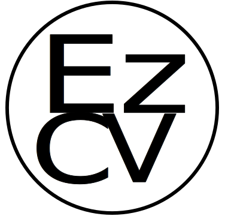

  

# EZ CV

A free and open-source resume builder that simplifies the process of creating, updating, and sharing your resume.

Our work is built upon a fork of [Reactive Resume](https://github.com/AmruthPillai/Reactive-Resume) by [Amruth Pillai](https://www.amruthpillai.com/). Please check out his work.

The project is made in part of an internship at [The Tech Collective EU](https://github.com/thetechcollective) by
[KurisuDaNoda](https://github.com/KurisuDaNoda),
[MagicalGlove](https://github.com/MagicalGlove),
[Mfknudsen](https://github.com/Mfknudsen) and
[SMerved](https://github.com/SMerved).

The bid-manager role aim to allow companies to bid on projects created by other companies using a collection of cvs created by users on our platform.

We also aim to separate the data so that a user can maintain ownership over their own data and so that they decide who can access it and in what manner they can.

With the control of data, we hope to provide an API for integration with already existing systems, so that a user only needs to maintain their cv once and have it reflected on the other platforms they may use.

### [Go to App](https://dev.ezcv.thetechcollective.dev/)

## Description

EZ CV is a free and open-source resume builder that simplifies the process of creating, updating, and sharing your resume. With zero user tracking or advertising, your privacy is a top priority. The platform is extremely user-friendly and can be self-hosted in less than 30 seconds if you wish to own your data completely.

It's available in multiple languages and comes packed with features such as real-time editing, dozens of templates, drag-and-drop customisation, and integration with OpenAI for enhancing your writing.

You can share a personalised link of your resume to potential employers, track its views or downloads, and customise your page layout by dragging-and-dropping sections. The platform also supports various font options and provides dozens of templates to choose from. And yes, there's even a dark mode for a more comfortable viewing experience.

Start creating your standout resume with EZ CV today!

## Templates

| Azurill                                                      | Bronzor                                                     | Chikorita                                                   |
|--------------------------------------------------------------|-------------------------------------------------------------|-------------------------------------------------------------|
|  |  |  |

| Ditto                                                       | Kakuna                                                      | Nosepass                                                    |
|-------------------------------------------------------------|-------------------------------------------------------------|-------------------------------------------------------------|
|  |  |  |

| Onyx                                                        | Pikachu                                                     | Rhyhorn                                                     |
|-------------------------------------------------------------|-------------------------------------------------------------|-------------------------------------------------------------|
|  |  |  |

## Features

- **Free, forever** and open-source.
- No telemetry, user tracking or advertising.
- You can self-host the application in less than 30 seconds.
- **Available in multiple languages**.
- Use your email address (or a throw-away address, no problem) to create an account.
- You can also sign in with your GitHub, Google and Microsoft account, and even set up two-factor authentication for extra security.
- Create as many resumes as you like under a single account, optimising each resume for every job application based on its description for a higher ATS score.
- **Bring your own OpenAI API key** and unlock features such as improving your writing, fixing spelling and grammar or changing the tone of your text in one-click.
- Translate your resume into any language using ChatGPT and import it back for easier editing.
- Create single page resumes or a resume that spans multiple pages easily.
- Customize the colours and layouts to add a personal touch to your resume.
- Customise your page layout as you like just by dragging-and-dropping sections.
- Create custom sections that are specific to your industry if the existing ones don't fit.
- Jot down personal notes specific to your resume that's only visible to you.
- Lock a resume to prevent making any further edits (useful for master templates).
- **Dozens of templates** to choose from, ranging from professional to modern.
- Design your resume using the standardised EuroPass design template.
- Supports printing resumes in A4 or Letter page formats.
- Design your resume with any font that's available on [Google Fonts](https://fonts.google.com/).
- **Share a personalised link of your resume** to companies or recruiters for them to get the latest updates.
- You can track the number of views or downloads your public resume has received.
- Built with state-of-the-art (at the moment) and dependable technologies that's battle tested and peer reviewed by the open-source community on GitHub.
- **MIT License**, so do what you like with the code as long as you credit the original authors.
- Create and maintain a companies.
- Search for other users who have created and selected a resume for their public page.
- Create building blocks using your experiences, educations and more, and use them to create multiple resumes.
- And yes, there’s a dark mode too 🌓

## Built With

- React (Vite), for the frontend
- NestJS, for the backend
- Postgres (primary database)
- Prisma ORM, which frees you to switch to any other relational database with a few minor changes in the code
- Azure Blob Storage (for object storage: to store avatars, resume PDFs and previews)
- Browserless (for headless chrome, to print PDFs and generate previews)
- SMTP Server (to send password recovery emails)
- GitHub, Google and Microsoft OAuth (for quickly authenticating users)
- LinguiJS and Crowdin (for translation management and localization)

## License

EZ CV is packaged and distributed using the [MIT License](/LICENSE.md) which allows for commercial use, distribution, modification and private use provided that all copies of the software contain the same license and copyright.

_By the community, for the community._  
An internship project built upon a passion project by [Amruth Pillai](https://www.amruthpillai.com/)
